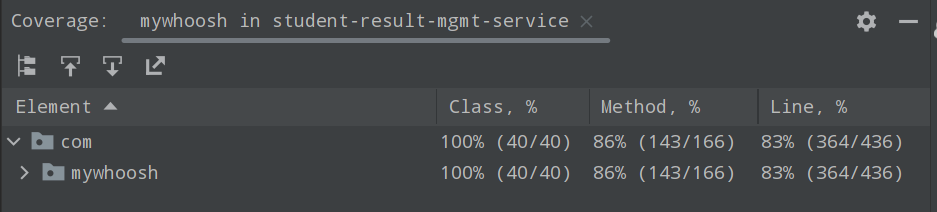

# student-result-management-service

A reactive result compilation platform


## Tech Stack

- Java 16
- Spring boot webflux
- spring boot security (jwt)
- mongodb


## Run Locally

Clone the project

```bash
  git clone https://link-to-project
```

Go to the project directory

```bash
  cd student-result-management-service
```

Install dependencies

```bash
  mvn clean install
```

Start the server

```bash
  mvn clean spring-boot:run
```
or

```bash
  java -jar target/<add jar>.jar
```
## Running Tests

To run tests, run the following command

```bash
  mvn clean tests
```

To run tests with coverage, run the following command

```bash
  mvn clean verify
```
## Usage/Examples

To use websocket

Start the server using

```bash
  mvn clean spring-boot:run
```
or

```bash
  java -jar target/<add jar>.jar
```

Open `index.html` in browser located under `src/main/resources/static`

```agsl
A DataIntializer class is provided to load data into mongodb. 
It runs as soon as the application starts.
```
```bash
  mvn clean spring-boot:run -Dspring-boot.run.arguments=--spring.profiles.active=dev
```


## API Reference

Start the server using

```bash
  mvn clean spring-boot:run
```

API reference can be found at  [Swagger-UI](`http://localhost:9080/swagger-ui.html`)

## Total Coverage: `83%`




## Tasks Related Questions

#### Total time taken

Answer : Took in days 4 with each day 1-3 hrs. Roughly 10-12 hrs.


